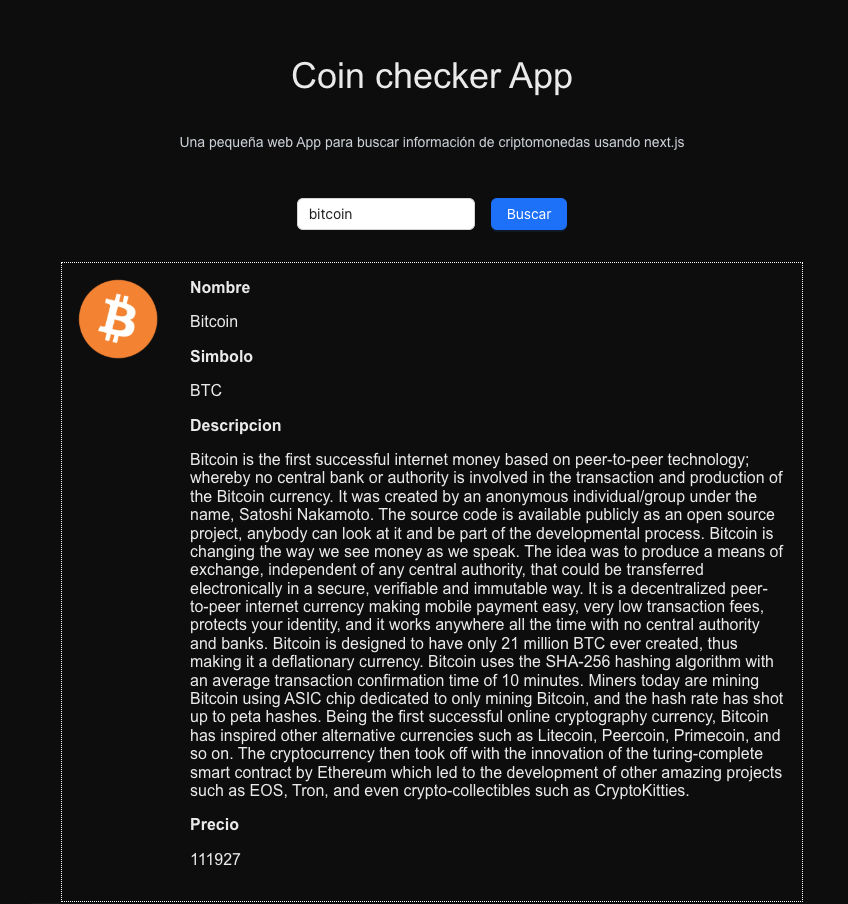

## App simple para consultar coins a través de la API de Coin gecko usando Nextjs

Pasos para correr el proyecto:

```bash
#1.- Clonar
git clone https://github.com/satoshidave/nextjs-coin-data.git
#2.- Instalar dependencias
npm i
#3.- Correr el proyecto
npm run dev
```

Una vez corra el proyecto, abrílo en tu navegador [http://localhost:3000](http://localhost:3000) y mirá el resultado.

## Como se usa?

Simplemente coloca en el Input de búsqueda el nombre de la coin que querés consultar. Debes colocar el nombre correcto y no el simbolo.

Una vez consultada y encontrada, te mostraremos la información de la coin como nombre, simbolo, precio, etc.

En caso que no encuentre la coin, se te avisará con un mensaje de error.


